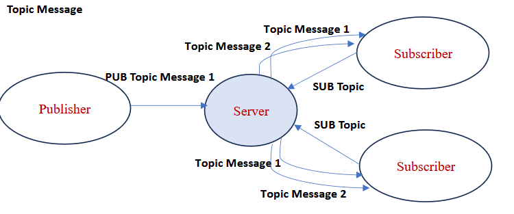

# VU Pub-Sub Messaging

## Description from the assignment

Create a concurrent server SimMQTT that simulates part of the work of MQTT broker. There are two
types of clients. The client Publisher connects to the server and sends a request in the following
form:

### PUB Topic Message

Where PUB is just the label for publication request to the server, while Topic is name of the specific
topic of one word (without spaces) and message is the message sent to the specific topic.

The client Subscriber connects to the server, and it subscribes to the specific topic with the following
request:

### SUB Topic

Where SUB is just the label for subscription request to the server, while Topic is name of the specific
topic of one word (without spaces).

The role of the server is to send the published message of a given topic to all the subscribers of that
topic that are currently connected, and the message should be printed on the screen for those
subscribers. The server response is of the form:

### Topic Message

